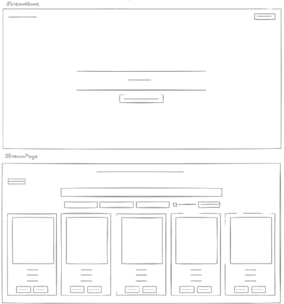
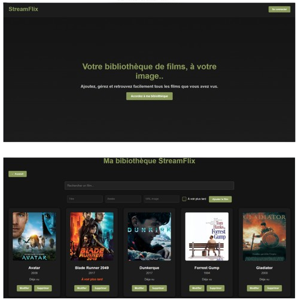

# StreamFlix
## l'application

Dans le cadre de ma formation de Développeur Web et Web Mobile (DWWM), j’ai conçu et développé en autonomie ce monorepo **StreamFlix**, une application fullstack dédiée à la gestion complète d’une liste de films. L’objectif principal était de créer, de A à Z, un CRUD fonctionnel et performant, avec une interface utilisateur réactive et intuitive permettant d’ajouter, consulter, modifier et supprimer des films.

Ce projet m’a offert l’opportunité de mettre en pratique la gestion d’état avec React, la communication avec une API REST, ainsi que la manipulation des données côté serveur et client.

Passionné de cinéma, toujours à la recherche du film à regarder, ou essayant de se souvenir de ce titre qu’on a adoré mais qu’on ne retrouve plus. Vous avez une pile de notes, des listes éparpillées, des souvenirs qui s’estompent… C’est frustrant, n’est-ce pas ?

C’est exactement pour ça que **StreamFlix** a été créé : pour rassembler toute votre passion en un seul endroit, facile à gérer et à retrouver.

La page **StreamHome** vous accueille comme une porte ouverte vers cet univers personnel, votre bibliothèque unique. Son message simple et motivant vous invite à prendre le contrôle, à ne plus perdre de temps à chercher, mais à commencer à construire votre collection, dès maintenant.

Une fois dedans, la page **StreamPage** devient votre espace personnel : un lieu où vous pouvez ajouter les films que vous avez vus, ceux que vous rêvez de découvrir, modifier vos choix, et garder un œil sur tout, en toute simplicité.

À vos télécommandes… ça va commencer !

## Les wireframes

## Les screenshots

